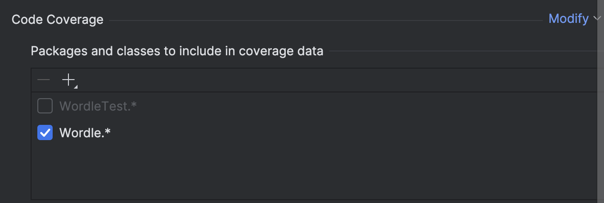
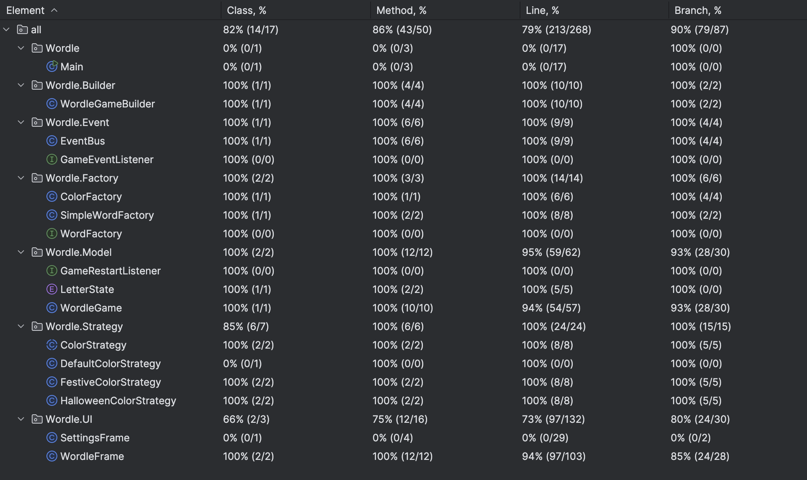

# OOAD Wordle Game

**Names**: Federico Ortega Riba, Noah Bays

## **TL;DR**

Wordle Game code reproduction following 5 OOAD patterns:
1. Factory pattern
2. Builder pattern
3. Singleton pattern
4. Observer pattern
5. Strategy pattern

## References Used

We based our Wordle on previous architectures that are publicly available, 
although the implementation and the GUI were adapted to our preferences.

Some Wordle examples:
1. matejpopovski: [Wordle Game in Java](https://github.com/matejpopovski/Wordle-Game)
2. ggleblanc2: [Wordle](https://github.com/ggleblanc2/wordle)

## Folder Structure

This is the folder structure that we have, where each class has its own JUnit test.

```src
src
|-- Wordle
|   |-- Builder
|   |   |-- WordleGameBuilder.java
|   |-- Event
|   |   |-- EventBus.java
|   |   |-- GameEventListener.java
|   |-- Factory
|   |   |-- ColorFactory.java
|   |   |-- SimpleWordFactory.java
|   |   |-- WordFactory.java
|   |-- Main.java
|   |-- Model
|   |   |-- GameRestartListener.java
|   |   |-- LetterState.java
|   |   |-- WordleGame.java
|   |-- Strategy
|   |   |-- ColorStrategy.java
|   |   |-- DefaultColorStrategy.java
|   |   |-- FestiveColorStrategy.java
|   |   |-- HalloweenColorStrategy.java
|   |-- UI
|   |   |-- SettingsFrame.java
|   |   |-- WordleFrame.java
```

## Explanation of the 5 patterns

### 1. Factory Pattern: 

```java
public interface WordFactory {
    String chooseWord(int wordLength);
}
```

WordFactory is the Factory interface.

SimpleWordFactory is a concrete factory that knows:
* which lists of words exist,
* which list to use based on wordLength,
* how to pick a random secret word.

Everywhere else (like WordleGameBuilder) just calls chooseWord(wordLength) and doesn’t know where the words came from or how they’re stored.

The ColorStrategy class is another factory: it hides which ColorStrategy subclass is created.

```java
public class ColorFactory {
    public static ColorStrategy createColorStrategy(String theme) {
        if (theme == null) {
            return new DefaultColorStrategy();
        }

        return switch(theme) {
            case "Festive" -> new FestiveColorStrategy();
            case "Halloween"  -> new HalloweenColorStrategy();
            default -> new DefaultColorStrategy();
        };
    }
}
```

### 2. Builder Pattern:

Builder is used when you have an object that needs to be built in several steps or with many configuration options.
The Builder:

* Collects configuration: wordLength, maxAttempts, wordFactory.
* Delegates to the Factory to get the actual secret word.
* Constructs a properly configured WordleGame.

```java
public class WordleGameBuilder {

    private int wordLength;
    private int maxAttempts;
    private WordFactory wordFactory = new SimpleWordFactory();

    public WordleGameBuilder withWordLength(int wordLength) { ... }
    public WordleGameBuilder withAttempts(int maxAttempts) { ... }
    public WordleGameBuilder withWordFactory(WordFactory factory) { ... }

    public WordleGame build() {
        String word = wordFactory.chooseWord(wordLength);
        if (word == null) {
            throw new IllegalStateException("Word list is empty for length " + wordLength);
        }
        return new WordleGame(word, maxAttempts);
    }
}
```

### 3. Strategy Pattern

Strategy is about choosing one of several interchangeable algorithms or behaviors at runtime. We program to an interface, and then plug in different implementations.

```java
abstract public class ColorStrategy {
    public Color getColorForState(LetterState state) {
        if (state == null) {
            return Color.WHITE;
        }

        return switch (state) {
            case ABSENT -> Color.LIGHT_GRAY;
            case PRESENT -> Color.YELLOW;
            case CORRECT -> Color.GREEN;
            default -> Color.WHITE;
        };
    }
}
```

Different subclasses implement different color schemes for the same states. For example, the Halloween Strategy does:

```java
public class HalloweenColorStrategy extends ColorStrategy {
    @Override
    public Color getColorForState(LetterState state) {
        // halloween colors
    }
}
```

### 4. Observer Pattern:

Observer defines a one-to-many relationship where one object (subject) notifies many listeners (observers) when something happens. The subject doesn’t need to know who exactly is listening.

Any class that wants to receive game messages, implements the observer interface:

```java
public interface GameEventListener {
    void onGameEvent(String message);
}
```

Then, the EventBus keeps a list of observers and when something happens, publish(message) calls onGameEvent on each listener.

```java
public LetterState[] guess(String guess) {
    if (isGameOver()) {
        EventBus.getInstance().publish("The game is already over.");
        throw new IllegalStateException("Game is already over.");
    }
    ...
```

Here WordleGame is the publisher of events (“That word is not correct”, “Your guess must have exactly … letters”, etc.) and doesn’t know who is listening.

WordleFrame implements GameEventListener and registers with the EventBus. When onGameEvent(message) is called, it shows the message in a label or dialog.

### 5. Singleton Pattern:

Singleton ensures a class has only one instance and provides a global access point to it.

```java
public class EventBus {

    private static final EventBus INSTANCE = new EventBus();

    private EventBus() { }

    public static EventBus getInstance() {
        return INSTANCE;
    }

    // ...
}
```

WordleGame uses the singleton EventBus to publish messages.
UI listeners register once on this same global EventBus.

## Testing

Only TDD tests using JUnit. Coverage can be shown doing: 
1. WordleTest [Double click] > 
2. More Run/Debug > 
3. Modify Run/Configuration... >
4. Code Coverage: add the Wordle package



4. Coverage is the following:


